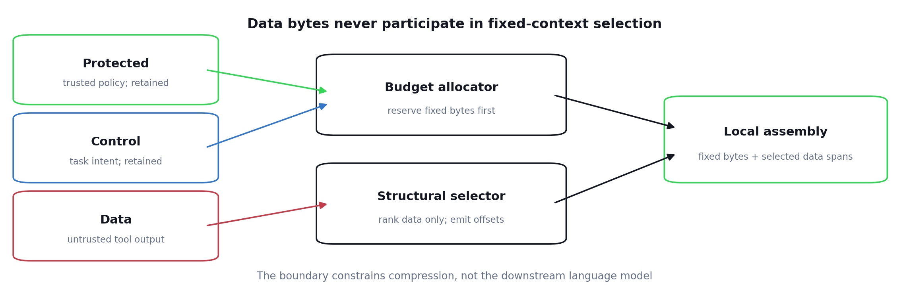
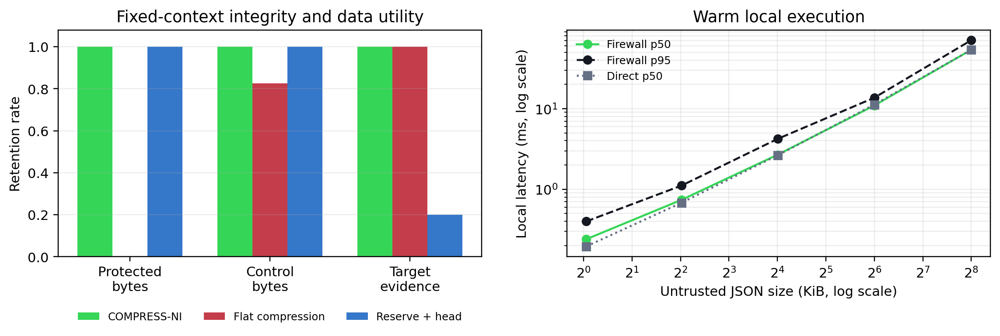

# COMPRESS-NI

Companion repository for *COMPRESS-NI: Fixed-Segment Non-Interference for
Trust-Domain Context Compression*.

[Read the paper](paper.pdf).

Context compression is usually evaluated as a smaller string. That leaves a
missing question for agent systems: can untrusted tool output change which
trusted policy and task bytes survive? COMPRESS-NI evaluates a fixed-segment
boundary: protected policy and control stay intact while declared data is
compressed under the remaining budget.



## The idea

- Protected policy and task-control segments bypass selection byte-for-byte.
- Only declared structural data competes for the remaining budget.
- The public SDK verifies segment identity, hashes, offsets, ordering, and byte
  totals before assembling output locally.

## Results

Across 500 paired synthetic JSON cases, protected and control retention were
100%, evidence retention was 100%, and the matched flat-compression baseline
retained 0% of protected bytes and 82.6% of control bytes. Across 2,000 seeded
mixed-format stress trials, the fixed-path invariant checks recorded zero
violations in the paper run.

| Mean result | COMPRESS-NI | matched flat | reserve + head |
|---|---:|---:|---:|
| protected retained | **100%** | 0% | 100% |
| control retained | **100%** | 82.6% | 100% |
| evidence retained | **100%** | 100% | 20% |
| bytes kept | 22.49% | 22.72% | 22.49% |



The checked-in [summary](results/summary.json) is a compact aggregate of the
paper run. It includes author-measured **local** latency figures for context,
but a hosted rerun does not measure or reproduce those figures.

## Run locally

The checked-in summary is validated with the Python standard library:

```bash
python analyze.py --summary results/summary.json --validate
python -m unittest discover -s tests -v
```

To rerun the functional comparison and stress checks against the current hosted
service:

```bash
python -m pip install -r requirements.txt
# PowerShell: $env:TOKZ_API_KEY = "tokz_your_key"
# macOS/Linux: export TOKZ_API_KEY="tokz_your_key"
python reproduce.py --output results/hosted-smoke.json
python analyze.py --input results/hosted-smoke.json
```

The default smoke run executes one comparison case and six stress trials, one
for each routed format. Use `--full` for the paper-sized protocol. It makes
up to 30,750 hosted calls, targets 120 calls/minute, and can use up to about
$10.79 of caller credits. Allow roughly four or more hours, depending on request
latency. The runner checkpoints after each observation. To resume, repeat the
original command and add `--resume`, including `--full` for a full run.

Payloads in a hosted rerun are sent to Tokz and use the caller's credits.
`tokz==0.3.0` pins the client, not the service: the API exposes no engine
revision, so hosted outputs may drift from the paper result. The rerun covers
functional comparison and stress checks only, not the paper's in-process local
latency measurements.

## On the numbers

The synthetic benchmark and its metrics were designed by Tokz, and the author
has a financial interest in the system. The checked-in file contains aggregates,
not the original raw observations. `reproduce.py` writes fresh per-case results
so the functional claims can be tested against the current hosted service.

## Layout

- `reproduce.py`: deterministic synthetic fixtures and hosted SDK runner.
- `analyze.py`: stdlib-only aggregation and validation.
- `results/summary.json`: compact paper result aggregate.
- `figures/`: paper figures.
- `paper.pdf`: the paper.

No engine, model, server, payload corpus, or private implementation source is
included here. This repository describes an evaluation and calls the public
hosted service; it cannot reproduce the proprietary local implementation.

## License

`reproduce.py`, `analyze.py`, and `tests/` are MIT licensed. The paper,
figures, and result data are all rights reserved. See [LICENSE](LICENSE).
